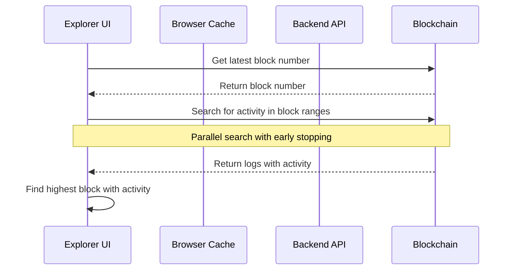

# Latest Active Block Flow

This document explains how the latest active block is fetched, cached, and invalidated in the explorer.

## Sequence Diagram



## Implementation Details

The explorer uses a parallel search strategy to find the most recent block with contract activity:

1. **Block Range Generation**

   ```javascript
   // From findLatestActiveBlock.js
   function generateSearchRanges(latestBlock, batchSize) {
     const ranges = [];
     let current = latestBlock;
     while (current >= 0) {
       const from = Math.max(0, current - batchSize + 1);
       ranges.push({ from, to: current, step: batchSize });
       current = from - 1;
     }
     return ranges;
   }
   ```

2. **Activity Check**

   - Uses ethers.js to check for contract events in each block range
   - Employs parallel processing with a semaphore limiting to 5 concurrent requests
   - Implements early stopping when activity is found

3. **Main Usage**
   ```javascript
   // From ProofFetchers.js
   let blockPointer =
     startFromBlock ??
     (await findLatestActiveBlock(config.rpcUrl, config.attestationAddress, BLOCK_STEP_SIZE, LATEST_BLOCK));
   ```

## Code References

The implementation is spread across several files:

1. `findLatestActiveBlock.js`: Core implementation for finding the latest active block

   - Uses `ethers.JsonRpcProvider` for blockchain interaction
   - Implements parallel search with early stopping
   - Uses `PromiseSemaphore` for concurrent request limiting

2. `ProofFetchers.js`: Main consumer of the functionality

   - Uses the latest active block as a starting point for event fetching
   - Continues fetching until enough events are found or max empty batches reached

3. `ProofConfig.js`: Configuration constants
   - `BLOCK_STEP_SIZE`: Size of block ranges to search
   - `LATEST_BLOCK`: Default latest block number

The implementation focuses on performance through:

- Parallel processing of block ranges
- Early stopping when activity is found
- Semaphore-based concurrency control
- Efficient block range generation
