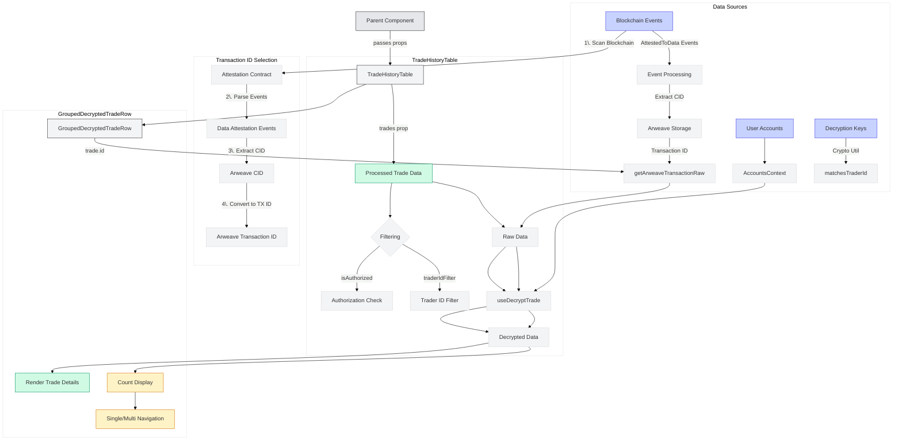

```mermaid
%%{init: {'theme': 'base', 'themeVariables': { 'primaryColor': '#f3f4f6'}}}%%
graph TD
    A[Parent Component] -->|passes props| B[TradeHistoryTable]
    B --> C[GroupedDecryptedTradeRow]

    subgraph Data Sources
        D[Blockchain Events] -->|AttestedToData Events| M[Event Processing]
        M -->|Extract CID| N[Arweave Storage]
        N -->|Transaction ID| E[getArweaveTransactionRaw]
        O[User Accounts] --> P[AccountsContext]
        Q[Decryption Keys] -->|Crypto Util| R[matchesTraderId]
    end

    subgraph Transaction ID Selection
        D -->|1\. Scan Blockchain| S[Attestation Contract]
        S -->|2\. Parse Events| T[Data Attestation Events]
        T -->|3\. Extract CID| U[Arweave CID]
        U -->|4\. Convert to TX ID| V[Arweave Transaction ID]
    end

    subgraph TradeHistoryTable
        B -->|trades prop| W[Processed Trade Data]
        W --> X{Filtering}
        X -->|isAuthorized| Y[Authorization Check]
        X -->|traderIdFilter| Z[Trader ID Filter]
        W --> AA[Grouped Trades]
        AA --> AB[Merged Action Column]
        AB --> AC[Dropdown Menu]
    end

    subgraph GroupedDecryptedTradeRow
        C -->|trade.id| E
        E --> AA[Raw Data]
        AA --> AB[useDecryptTrade]
        P --> AB
        AB --> AC[Decrypted Data]
        AC --> AD[Render Trade Details]
        AC --> AE[Count Display]
        AE --> AF[Single/Multi Navigation]
    end

    style A fill:#e5e7eb,stroke:#333
    style B fill:#f3f4f6,stroke:#333
    style C fill:#f3f4f6,stroke:#333
    style D fill:#c7d2fe,stroke:#4f46e5
    style O fill:#c7d2fe,stroke:#4f46e5
    style Q fill:#c7d2fe,stroke:#4f46e5
    style W fill:#d1fae5,stroke:#059669
    style AD fill:#d1fae5,stroke:#059669
    style AE fill:#fef3c7,stroke:#d97706
    style AF fill:#fef3c7,stroke:#d97706
```
