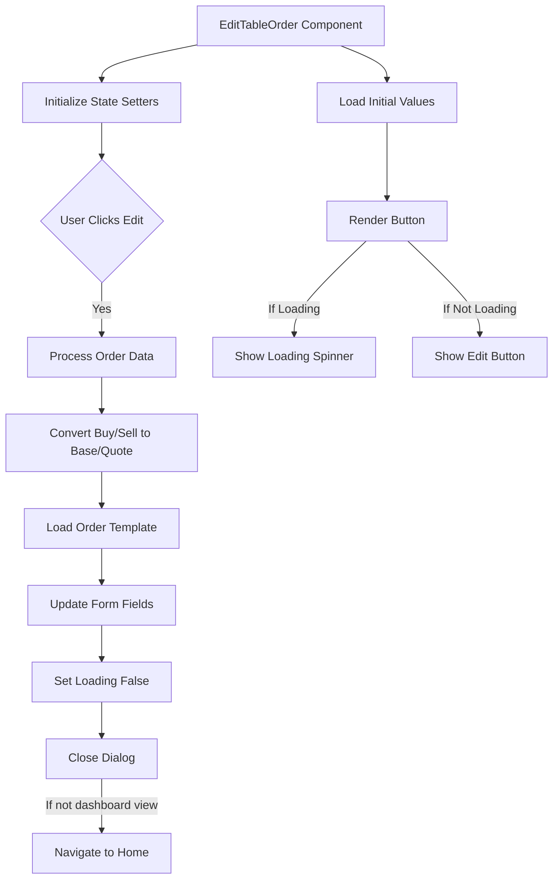
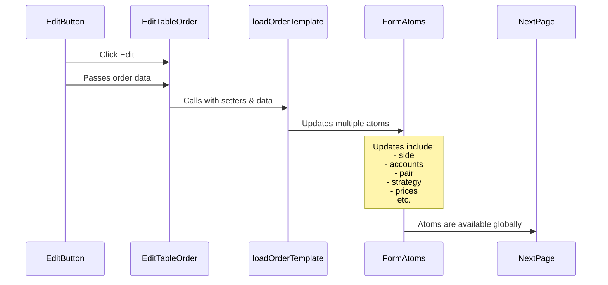

## EditTableOrder

- This component is used to edit an existing order.
- It is called from the TableOrderConfirmationModel component.
- It is also called directly from the SharedOrderTable component.

### High level flow

### When the user clicks edit

- The order data is processed to convert buy/sell to base/quote if necessary.
- The order template is loaded.
- The form fields are updated.
- The loading state is set to false.
- The dialog is closed.

